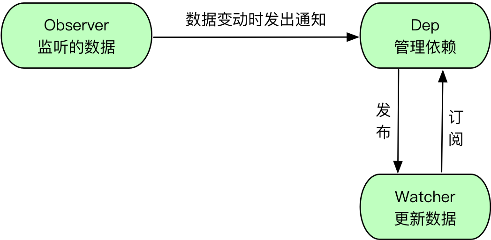

之前使用vue时就对响应式数据很感兴趣，最近有空参考vue代码实现了一个简单的demo。

代码主要分为三块：
- Observer
- Dep
- Watch

`Observer`负责重写对象的getter和setter，对数组的一些方法也做了覆盖，同时在数据更新时调用`Dep`。

`Dep`负责数据依赖的收集，在getter中向`Watcher`添加依赖，在数据更新时调用`notify`通知`Watcher`。

`Watcher`负责要监听的属性，先调用数据的getter触发`Dep`收集依赖，更新时调用回调。

## TODO
- Proxy实现
- 更新队列
